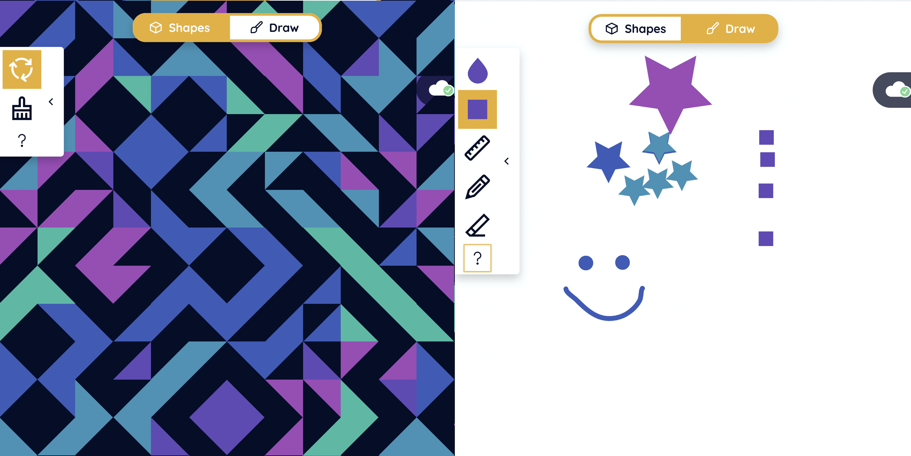

# Share-a-Sketch



### Develop

**Prerequisites**
This project requires you have [node](https://nodejs.org/en/download/) installed locally and uses [yarn](https://yarnpkg.com/) as a package manager. See instructions on those project pages to get those setup if you don't already have them available. You'll also need a [firebase](https://firebase.google.com/) project with realtime database.

1. Clone the repository from gitub

```
git clone git@github.com:carolineartz/share-a-sketch.git
```

2. navigate into the root directory

```
cd share-a-sketch
```

3. Install dependencies


```
yarn
```

4. Copy `.env.example` to `.env` and fill in the configuration values from your firebase project.

5. Log in to Firebase service

   The following command should open a browser window so you can log into Firebase.

```
yarn firebase login
```

6. Run the local development servers

   The following command should open a tab in your default browser running the app!

```
yarn dev
```
